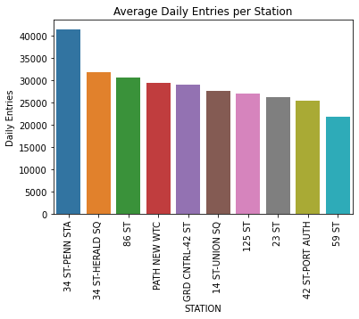
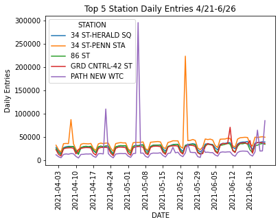

Braden Taack
### WTWY EDA Project MVP
#### September 14th, 2021
___
  
The goal of this project is to best direct the canvasing resources of the WTWY organization to the optimal spots on the NYC Subway System. 

To initially breakdown the problem from the complex NYC Subway system into bite-sized chunks, I calculated the average daily entrances for each station. Using this list to focus in on the top 10 busiet stations by average daily entrances, I am able to dive into greater detail for the organization. 

Next I focused on trying to find the best days of the week to visit the top 10 stations. I plotted the time series of daily entries for each subway from April 2021 to June 2021. This range of dates was chosen as it would offer specifc insight to the timeframe that WTWY will actually be collecting emails and offering up tickets. A key takeaway from this chart is that each of the observed stations had the largest influx of entries during weekdays. 

Further work for the project will include doing more time-based analysis on the top 5 stations. I will evaluate the best days of the week for each station, and the best times on those days to visit the stations. This information should give the WTWY group enough detail to put their people in places with the confidence that they will get results. 
